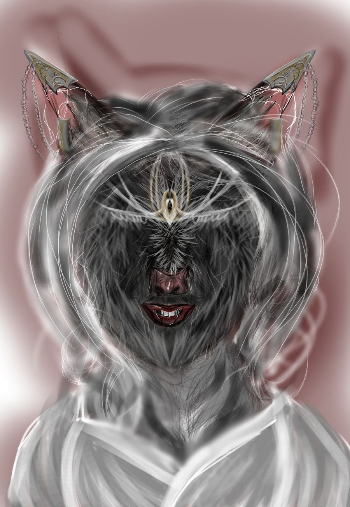

## 002 Nyl Hired for Unknown Job

`Illustration by A.G. Neff`

I dreaded the coming feast which primarily existed to allow time for placing bets. While I clumsily clothed myself in a dress tailored for people of another race, a clawed hand grabbed my shoulder.

**“Follow me, quickly!”** my mistress, Gemma, who burst into my apartment without knocking, ordered through the vibrations in her fingertips.

“Why?”

**“I’ve sold you to one of the honored guests at the feast tonight. The fool paid ten times what you're worth, so I'd best deliver you promptly and hear that you're properly dressed.”**

“What my job?”

**“How should I know? All I care for is the silver he offered.”**

“What his name?”

**“I didn’t actually meet him. Stop asking so many questions!”** she struck me; damaging my face would not reduce the amount of silver she would receive.

My mistress massaged my forehead with her thumbs as she morphed my body into that of a mildly pretty halfling woman, a disguise which would dissolve by the morning. I wished ever so much that it would last. Then maybe someone would purchase me to perform tedious chores rather than criminal operations.

Death had robbed my body of its strength and form too many times already and would steal from me again tomorrow. I feared most for my daughter. If I died, she would not resurrect with me. My mistress always charged her customers extra if they killed me after a job, but no amount of silver could compensate for the life of my precious child. They always killed me. After whatever crime they hired me for, anything from assassination to forgery, it was best if I died so as not to snitch on them.

Tomorrow it would be the same, I would resurrect to find my abdomen void of the precious life I carried. I had hoped to hold her at least once.

Gemma roughly dragged me to the great hall where the feast in honor of the great tournament would be held.

**"You can find your way from here,"** my mistress declared. **"Your new master is 100 throses away, straight ahead of you."**

"Yes," I replied, knowing I could not find my new master without aid.

*What will he be like?*
